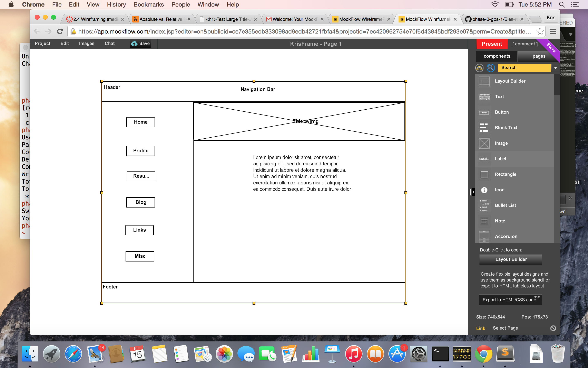

What is a wireframe?

A wireframe is a skeleton of what you want your website to look like.

What are the benefits of wireframing?

Wireframing is benificial for planning. Whether it is for your own site or your clients, you can review how you want the page to be set up and make sure all elements wanted are included. It is a good blue print to work off of.

Did you enjoy wireframing your site?

Sure, but I did mine from scratch so I may want to change it. I didn't want to get too fancy because I don't know what I am doing yet. I was looking at some professional templates, but they are too much for me at this point.

Did you revise your wireframe or stick with your first idea?

Still on the first one as of now.

What questions did you ask during this challenge? What resources did you find to help you answer them?

My first question was "How do I create a wireframe?" Is that too obvious? I signed up with mockflow.com and this was a very easy website to use to create my first wireframe. 

Which parts of the challenge did you enjoy and which parts did you find tedious?

Honestly I am still not sure what Release 2 was asking me to do on this challenge. It asks you to wireframe your html blog template. I copied the template and made changes to it for it to list my blogs and pushed it to github. I didn't know if it was asking to see an actual wireframe on the page though, does that sound silly?

"Wire Frame")

